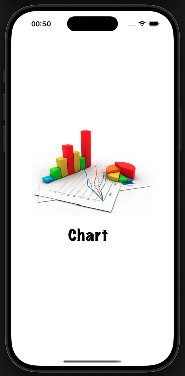
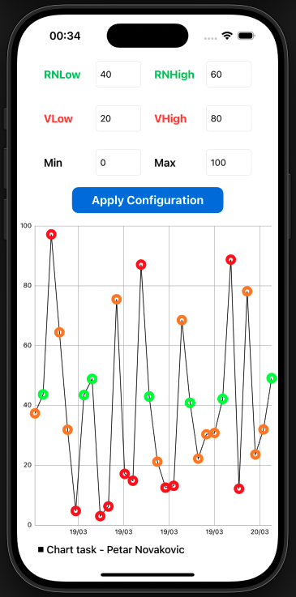
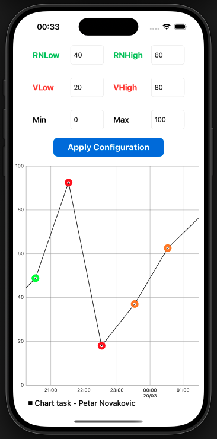
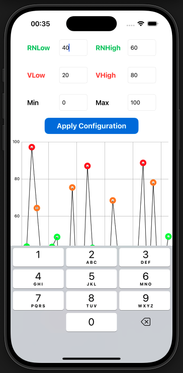

# Chart
Chart iOS app covering:

  -  Swift/UIKit – Core tools for building iOS apps with imperative UI.
  -  MVC Architecture – Design pattern for separating model, view, and controller.
  -  DGCharts – Using DGCharts for customizable chart visualizations.
  -  LineChartView – Custom component for rendering line charts.
  -  Mocking API – Generating 30 random chart values per App session for testing.
  -  AlertManager - Utility class for displaying app alerts.

📌 Note:
  -  Each time the app is launched, 30 random Double values between 0...100 are generated.
  -  These values are assigned to time intervals in the next 30 hours.
  -  This logic ensures that 00:00 will be displayed on the X axis.
  -  Apply Configuration Button confirms the values entered in the 6 input fields.
  -  The time/date display transition occurs at a Zoom value of 1.3
  -  To observe the date and time format for the value 00:00, the Chart should be zoomed in to display intervals with rounded hours.
  -  This state is visible in one of the screenshots.

📸 Screenshots

<table>
  <tr>
    <td></td>
    <td></td>
    <td></td>
    <td></td>
  </tr>
</table>
